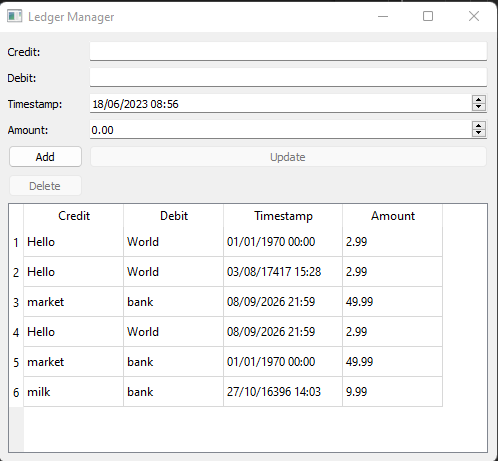

## Lesson 1 - Introduction

Welcome the Chat GPT master class. In this class you will learn what chat GPT is on a high-level, also, how it works, and how you can use it to build a business.  If this sounds interesting, let's dig in.

### 1.1 What is Chat GPT?

A program, when enhanced with artificial intelligence and capable of responding to a human being, by generating responses to text input from a computer in a conversational manner. Such a program is known chat bot.

Chat GPT is a special class of chat bots that has been trained on a very large body of text, typically above 50 gigabytes and and into the terabytes of data. These type training models are known as large language models (LLMs). The acronym GPT translates as Generative Pre-trained Transformers and this gives an indication into the technology behind chat GPT. Chat GPT uses a classic machine learning class of artificial intelligence categorised as supervised training, where the model uses the large body of text as examples of how to predict the next word based on the previous text. In addition, it uses a special class of neural networks known as Transformers to maintain semantic information across sequence lengths. In summary, the language model does not only track word sequences but also the logical meaning of the sentences and paragraphs it processes, so that when it generates its own text, it is logically consistent with human understanding and the grammar used for training.

### 1.2 Chat GPT Uses

Enough of the technical details. Let's dive into using Chat GPT. According to Andrew NG in the deeplearning.ai prompt engineering [course](https://learn.deeplearning.ai/chatgpt-prompt-eng/), where this master class draws inspiration from, chat GPT excels in the following areas:

- Summarising
- Inferring
- transforming
- expanding
- code generation

Generally, we will be using chat GPT as a question answering and code generation tool to help us build a business from scratch.

### 1.3 Summary

Hi there! In this class, we will learn about something called Chat GPT. It's like a robot that can talk to people using a computer! This robot has been trained to understand words and sentences in a special way so it can answer questions and even help with making computer programs. We will use it to help us build a new business. Isn't that cool? Let's get started! This summary was generated by chat GPT when asked to rephrase the above sections for a 5 year old. I hope it helped!

### 1.4 Tasks
1. Double entry accounting
2. PDF LLM adaptation
3. Video/Audio LLM adaptation
4. Create GPT2 model
5. Investment-bot

## Lesson 2

Welcome to lesson 2.  In lesson one, we left off outlining a list of projects which we will be using Chat GPT to implement.  We start with a simple financial double-entry system.  Then, we shall a detour into the mechanics of GPT and return back into the world of finance to implement a more advanced financial application - an investment bot.  but why take the detour?  Well, in this master class, we will be comparing 3 different strategies for using ChatGPT.  The first is the simple way, this is, without prompt engineering, let us call this the brute force method. We would in this master class use practical projects to discover why prompt engineering is essential and how it makes us accomplish more, than without prompt engineering.  So the use of prompt engineering will be the second method at the heart of this class, but we won't stop there!  In this class, I will go the extra mile to use advanced methods which are of interest to the researcher.  This will be the ultimate test for the prompt engineering method.  By comparing large language model prompt engineering techniques to more traditional artificial intelligence research methods, we will be able to characterise ChatGPT mechanics and better understand if, why, and how prompt engineering gives the results it does.  It is important to note that at all times, chatGPT would still be utilised in all of the methods at the micro-level and we will be applying prompt engineering skills at various levels to all the tasks.   Also note that although I will take great pains to oversimplify the advanced methods, I will also keep it as much as I can, academically engaging such that a researcher can repeat the experiments on their own.  Moreover, the advanced methods will NOT be required to understand the rest of the materials in this class and can be skipped altogether by those who are only interested in the main focus of the master class, which is prompt engineering.  For such individuals, you will only be interested in the names of the methods, the resulting outcomes, and how they stacked up against prompt engineering methods and chatGPT's artificial and arguably sparks of "_general_" intelligence.

As this class is designed to be hands-on, the main techniques in prompt engineering will first be outlined and explained in this lesson.  In the next lesson, we shall dive into our first project to apply the principles learned in this lesson.  Let's get started!  So what are the main techniques in prompt engineering?

### 2.1 Prompt engineering principles.

As ChatGPT itself surmises, to guide a model toward the desired output and reduce the chances of irrelevant or incorrect responses, it is important to provide clear and specific instructions, which may require longer prompts for more clarity and context.  This in a nutshell sums up prompt engineering.  Nevertheless, it is necessary to expand on this.  I shall first of all use my own analysis of the above assertion, and then, use the above definition to illustrate how one can apply the principle to perform text inference using ChatGPT.

So the summary given by ChatGPT has two principles in one
1. Clear and concise instruction
2. Apply context

As we see later, there is the third principle of iteration. This is done to refine ChatGPT results.  Nevertheless, these two principles appear to be in conflict with each other, and rightly so.  To get the best out of ChatGPT, one needs the right mixture of both conciseness as well as giving context.  This, in summary, means that while using chat GPT, you would need to give as much information as possible about the objective and this information should be as specific as possible. Let us call this prompt engineering technique context specification. Another way to describe context specification is by saying that while requesting information from chat GPT it would be beneficial to narrow the information or context to as many anchors as possible which will guide the response to the specific answer and results that you desire. Techniques of context narrowing include 
1. Using text boundaries to avoid text injection
2. Asking chat GPT to role play
3. Identifying the target audience
4. Specifying the length of the response
5. Using response formatters
6. Applying types of responses to prompts (see section 1.2 in lesson 1)
7. Using the above techniques to ask chat GPT to refine your prompt

While we shall learn more about these techniques throughout this class, let us first ask chatGPT to provide us with what it thinks the principles of prompt engineering techniques are.  In this prompt, we will apply some of the techniques outlined above to specify context.   Here is the prompt:

given text in the 'text' tag, Expand on this by providing three bullet point principles of prompt engineering and explaining why these principles are most effective. Here is the text.`<text>` to guide a model towards the desired output and reduce the chances of irrelevant or incorrect responses, it is important to provide clear and specific instructions, which may require longer prompts for more clarity and context `</text>`

Here is the result:

Here are the three bullet point principles of prompt engineering and why they are effective:

1. Be clear and specific
	Clear and specific instructions provide a structure for the model to follow, which helps to reduce irrelevant or incorrect responses. It is important to define the task and the expected output as specifically as possible so that the model can accurately interpret what is being asked of it
2. Provide context
	Context is important in helping models understand the nuances of language and the meaning behind the words. Longer prompts with more context can provide a more complete understanding of the task at hand, improving the model's ability to generate accurate responses.
3. Avoid ambiguity 
	Ambiguity in prompts can lead to confusion and incorrect responses from the model. It is important to use precise language and avoid idioms or phrases that could be interpreted in multiple ways. Additionally, providing examples and clarifying any potential misunderstandings can help prevent ambiguity in prompts.

Out of the seven techniques outlined above which techniques were used to produce the above prompt? In what way can this prompt be improved?

## Lesson 3 - Principle 3 - Iteration!

Welcome to lesson 3.  We pick up this lesson by answering the last question in section 2.  In what way could the prompt asking chat GPT to discuss the principles of prompt engineering be improved?  So, in this lesson, the iteration method of improving the output of a prompt is introduced.  This method prompts Chat GPT successively in a conversation-style interaction.  One could achieve this by repeating the same question using an alternate phrase that conveys the same meaning or highlights other contexts altogether. Another strategy would be by further narrowing down the initial prompt to ask chat GPT provide further details on the original goal or based on the response.  In the prompt below, we answer the question at the end of lesson two using the first strategy.  This is to ask the question in a different manner by telling chat GPT to provide good and bad examples of the subject of the prompt.  Here is the prompt.

_given text in the 'text' tag, Expand on this by providing three bullet point principles of prompt engineering and explaining why these principles are most effective.  In addition, for each bullet point provide a related example of a wrong prompt and the correct method that applies the principle. Here is the text_.<text>to guide a model towards the desired output and reduce the chances of irrelevant or incorrect responses, it is important to provide clear and specific instructions, which may require longer prompts for more clarity and context </text>

and here is the response:

Certainly, here are three bullet point principles of prompt engineering along with an example of a wrong prompt and a corrected version that applies the principle:

#### 1. Be clear and specific

Wrong Prompt: "Write a paragraph about your day"

Corrected Prompt: "Write a paragraph about your day yesterday, including at least three specific activities you did"

The corrected prompt is more specific because it asks for yesterday's activities, rather than just any day, and specifies the number of activities required.

#### 2. Provide context

Wrong Prompt: "Summarize this article"

Corrected Prompt: "Summarize this news article about the recent political protests in Hong Kong, including the main issues and demands of the protesters" 

The corrected prompt provides more context by specifying what topic the article is about and what aspects of the article should be summarized.

#### 3. Avoid ambiguity

Wrong Prompt: "Explain how to use a hammer"

Corrected Prompt: "Write a step-by-step guide on how to use a hammer to hang a picture frame"

The corrected prompt is less ambiguous because it specifies a particular task (hanging a picture frame) and provides a specific goal, which will help the model to generate a more focused response.


### 3.1 The Ledger Manager program
In this lesson, we promised to use Chat GPT to implement an expense manager.   So in this lesson, we begin the first part of that program which is a ledger manager program.

Some people describe chat GPT as a very knowledgeable 10 year old.  While initially, I was really impressed with Chat GPT's capabilities.  I tend to agree that though quite knowledgeable, Chat GPT still requires guidance and doesn't always gives exactly correct answers.  As such, when prompt engineers refer to the use of iteration as a method to refine Chat GPT's responses, this can be likened to when a child is guided to the correct answer when interacting with them on a problem.  With Chat GPT, especially in this context of being used for programming, some users describe Chat GPT as a junior developer, where it can write correct programs but does not always take into consideration the pragmatics and architectural patterns a senior developer may consider when working on a problem.   I certainly found this to be the case.  In the first instance, the quickest limitation on ChatGPT3+ is the amount of tokens it can process and produce.  So while, chat GPT can write some programs it is worth bearing in mind that it  may not be able to complete an entire project.  So it bears upon the engineer to design how ChatGPT assists with program writing.  For me as an aspiring solution architect, I am especially enjoying using Chat GPT to test drive the process of breaking down a solution to manageable chunks for more Junior developers which is the role of Chat GPT to engineer.  

How have I done this?  For the expense manager, I have started with the core engine which is the Ledger manager.  Having done some requirements engineering, I have decided to break down the Expense manager program by working on a core accounting book keeping program called a ledger manager.  Normally for this type of decisions, I would not consult ChatGPT as these architectural decisions may not be within the reach of ChatGPT's non-contextual reasoning.  To justify the hypothesis, I did a series of prompts to which I got some initial useful inputs, but could not get ChatGPT to decipher the more nuanced ideas behind the expert manager solution.  To this end I utilised chat GPT as more or less a a junior developer helping to simulate my ideas.

I could not get ChatGPT to come up with a solution for an expense manager that I could work with.  This was because, it could only generate information about the final goal which was the expense manager.  Nevertheless, I wanted to use the ledger manager as a basis of any accounting solution which would also include an expense manager.

Here is the analysis of the ledger manager.  In the most accepted method of solving the accounting problem, the double entry system, the ledger consists of two accounts, one being debited, while the other being credited.  The simplest way to achieve this is using a ledger entry that consists of the debited account, the credited account, the amount and the date of the transaction.  Each account will be categorised according to the type to which they belong to which will also satisfy financial accounting rules and reporting.  This categorisation is typically technically known as the chart of accounts.

In other to give chat GPT the context of the solution, I wanted to be able to use a graphical user interface to test the program and I also wanted the code to be in C++.  Here is the resulting prompt

Prompt 1
```
I would like to create a book keeping system using C++.  This would consist of four entities: 1. TransactionType enumeration 2 values a) credit and b) debit 2.) AccountChart enumeration having the following values: Assets, Liabilities, Equity, Revenue, CostOfGoodsSold, OperatingExpenses, TaxesPaid, OtherExpenses 3.) Account class having the following fields: a) category: AccountChart enum b) accountId: int c) accountName: std::string. 4) Ledger class having the following fields: a) debit, credit, date, amount
```
Prompt 1 Response
```c++
enum TransactionType {
    credit,
    debit
};

enum AccountChart {
    Assets,
    Liabilities,
    Equity,
    Revenue,
    CostOfGoodsSold,
    OperatingExpenses,
    TaxesPaid,
    OtherExpenses
};

class Account {
public:
    Account(AccountChart category, int accountId, std::string accountName) : 
        category_(category), accountId_(accountId), accountName_(accountName) {}

private:
    AccountChart category_;
    int accountId_;
    std::string accountName_;
};

class Ledger {
public:
    Ledger(Account credit, Account debit, long timestamp, double amount) :
        credit_(credit), debit_(debit), timestamp_(timestamp), amount_(amount) {}

private:
    Account credit_;
    Account debit_;
    long timestamp_;
    double amount_;
};
```
In the above prompt, for chat GPT to respond accurately to the problem, I had to be clear and as detailed as possible to give the right context for the response.  I gave ChatGPT the exact fields that I wanted, and how I wanted the entities to be created.  You can see here that chat GPT is working as a junior developer and the information given is similar.  Note that here the details is the common denominator that shared between chat GPT and the junior developer as well.  Note that it is not all the time that chat GPT will give the exact response that you want.  You have to keep this in mind that you may make one or two corrections or ask chat GPT to correct itself as you will see in the subsequent text.

After using chat GPT to define the C++ classes for the program, I will use strategy 3 in this second prompt iteration, where I further give chatGPT an additional request, and since I am already on a current session with chat GPT, it already has the previous context in memory. Here is the prompt used to gain additional code from to further my goal based on previous results.

```
Create a QT application using QSqlDatabase, sqlite and QT widgets to perform CRUD operations on the Ledger class
```
Here is the response:
```C++

#include <QtWidgets>
#include <QtSql>

class Ledger {
public:
    Ledger(QString credit, QString debit, long timestamp, double amount) :
        credit_(credit), debit_(debit), timestamp_(timestamp), amount_(amount) {}

    QString getCredit() const { return credit_; }
    QString getDebit() const { return debit_; }
    long getTimestamp() const { return timestamp_; }
    double getAmount() const { return amount_; }

private:
    QString credit_;
    QString debit_;
    long timestamp_;
    double amount_;
};

class MainWindow : public QMainWindow {
    Q_OBJECT

public:
    MainWindow(QWidget *parent = nullptr);
    ~MainWindow();

private slots:
    void onAddButtonClicked();
    void onUpdateButtonClicked();
    void onDeleteButtonClicked();
    void onSelectionChanged();

private:
    void createDatabaseTable();
    void loadLedgerData();
    void clearFormFields();

    QSqlDatabase database_;
    QList<Ledger> ledgerData_;

    QLabel* creditLabel_ = nullptr;
    QLineEdit* creditLineEdit_ = nullptr;
    QLabel* debitLabel_ = nullptr;
    QLineEdit* debitLineEdit_ = nullptr;
    QLabel* timestampLabel_ = nullptr;
    QDateTimeEdit* timestampDateTimeEdit_ = nullptr;
    QLabel* amountLabel_ = nullptr;
    QDoubleSpinBox* amountSpinBox_ = nullptr;

    QTableView* tableView_ = nullptr;
    QPushButton* addButton_ = nullptr;
    QPushButton* updateButton_ = nullptr;
    QPushButton* deleteButton_ = nullptr;
};

MainWindow::MainWindow(QWidget *parent)
    : QMainWindow(parent)
{
    // Create database connection
    database_ = QSqlDatabase::addDatabase("QSQLITE");
    database_.setDatabaseName(":memory:");
    database_.open();

    // Create database table
    createDatabaseTable();

    // Setup main window layout
    QWidget* centralWidget = new QWidget(this);
    QGridLayout* gridLayout = new QGridLayout(centralWidget);

    // Create form fields
    creditLabel_ = new QLabel("Credit:");
    gridLayout->addWidget(creditLabel_, 0, 0);
    creditLineEdit_ = new QLineEdit();
    gridLayout->addWidget(creditLineEdit_, 0, 1);

    debitLabel_ = new QLabel("Debit:");
    gridLayout->addWidget(debitLabel_, 1, 0);
    debitLineEdit_ = new QLineEdit();
    gridLayout->addWidget(debitLineEdit_, 1, 1);

    timestampLabel_ = new QLabel("Timestamp:");
    gridLayout->addWidget(timestampLabel_, 2, 0);
    timestampDateTimeEdit_ = new QDateTimeEdit(QDateTime::currentDateTime());
    gridLayout->addWidget(timestampDateTimeEdit_, 2, 1);

    amountLabel_ = new QLabel("Amount:");
    gridLayout->addWidget(amountLabel_, 3, 0);
    amountSpinBox_ = new QDoubleSpinBox();
    gridLayout->addWidget(amountSpinBox_, 3, 1);

    addButton_ = new QPushButton("Add");
    gridLayout->addWidget(addButton_, 4, 0);

    updateButton_ = new QPushButton("Update");
    updateButton_->setEnabled(false);
    gridLayout->addWidget(updateButton_, 4, 1);

    deleteButton_ = new QPushButton("Delete");
    deleteButton_->setEnabled(false);
    gridLayout->addWidget(deleteButton_, 5, 0);

    // Create table view
    tableView_ = new QTableView();
    tableView_->setSelectionBehavior(QAbstractItemView::SelectRows);
    gridLayout->addWidget(tableView_, 6, 0, 1, 2);

    // Set main window properties
    centralWidget->setLayout(gridLayout);
    setCentralWidget(centralWidget);
    setWindowTitle("Ledger Manager");

    // Load data and connect signals/slots
    loadLedgerData();
    connect(tableView_->selectionModel(), SIGNAL(selectionChanged(QItemSelection,QItemSelection)),
            this, SLOT(onSelectionChanged()));
    connect(addButton_, SIGNAL(clicked(bool)), this, SLOT(onAddButtonClicked()));
    connect(updateButton_, SIGNAL(clicked(bool)), this, SLOT(onUpdateButtonClicked()));
    connect(deleteButton_, SIGNAL(clicked(bool)), this, SLOT(onDeleteButtonClicked()));
}

MainWindow::~MainWindow()
{
    database_.close();
}

void MainWindow::createDatabaseTable()
{
    QSqlQuery query(database_);

    bool success = query.exec("CREATE TABLE ledger ("
                              "credit TEXT,"
                              "debit TEXT,"
                              "timestamp INT,"
                              "amount REAL)");

    if (!success) {
        qWarning() << "Failed to create database table: " << query.lastError().text();
    }
}

void MainWindow::loadLedgerData()
{
    QSqlQuery query(database_);

    bool success = query.exec("SELECT credit, debit, timestamp, amount FROM ledger");
    if (success) {
        while(query.next()) {
            QString credit = query.value(0).toString();
            QString debit = query.value(1).toString();
            long timestamp = query.value(2).toLongLong();
            double amount = query.value(3).toDouble();
            Ledger entry(credit, debit, timestamp, amount);
            ledgerData_.append(entry);
        }

        // Bind data to table view
        QStandardItemModel* model = new QStandardItemModel(ledgerData_.size(), 4, this);

        QStringList headers;
        headers << "Credit" << "Debit" << "Timestamp" << "Amount";
        model->setHorizontalHeaderLabels(headers);

        for (int row = 0; row < ledgerData_.size(); ++row) {
            const Ledger& entry = ledgerData_[row];
            model->setData(model->index(row, 0), entry.getCredit());
            model->setData(model->index(row, 1), entry.getDebit());
            model->setData(model->index(row, 2), QDateTime::fromSecsSinceEpoch(entry.getTimestamp()));
            model->setData(model->index(row, 3), entry.getAmount());
        }

        tableView_->setModel(model);
    } else {
        qWarning() << "Failed to load table data: " << query.lastError().text();
    }
}

void MainWindow::clearFormFields()
{
    creditLineEdit_->clear();
    debitLineEdit_->clear();
    timestampDateTimeEdit_->setDateTime(QDateTime::currentDateTime());
    amountSpinBox_->setValue(0.0);
}

void MainWindow::onAddButtonClicked()
{
    QString credit = creditLineEdit_->text();
    QString debit = debitLineEdit_->text();
    long timestamp = timestampDateTimeEdit_->dateTime().toSecsSinceEpoch();
    double amount = amountSpinBox_->value();

    // Insert new record into database
    QSqlQuery query(database_);
    query.prepare("INSERT INTO ledger (credit, debit, timestamp, amount) "
                  "VALUES (:credit, :debit, :timestamp, :amount)");
    query.bindValue(":credit", credit);
    query.bindValue(":debit", debit);
    query.bindValue(":timestamp", timestamp);
    query.bindValue(":amount", amount);

    bool success = query.exec();

    if (!success) {
        qWarning() << "Failed to add record to database: " << query.lastError().text();
    } else {
        // Reset form fields and reload data
        clearFormFields();
        loadLedgerData();
    }
}

void MainWindow::onUpdateButtonClicked()
{
    // Get selected model index
    QModelIndexList selection = tableView_->selectionModel()->selectedIndexes();
    int currentRow = selection.at(0).row();

    QString credit = creditLineEdit_->text();
    QString debit = debitLineEdit_->text();
    long timestamp = timestampDateTimeEdit_->dateTime().toSecsSinceEpoch();
    double amount = amountSpinBox_->value();

    // Update existing record in database
    QSqlQuery query(database_);
    query.prepare("UPDATE ledger SET credit=:credit, debit=:debit, "
                  "timestamp=:timestamp, amount=:amount WHERE rowid=:rowid");
    query.bindValue(":credit", credit);
    query.bindValue(":debit", debit);
    query.bindValue(":timestamp", timestamp);
    query.bindValue(":amount", amount);
    query.bindValue(":rowid", currentRow+1);

    bool success = query.exec();

    if (!success) {
        qWarning() << "Failed to update record in database: " << query.lastError().text();
    } else {
        // Reset form fields and reload data
        clearFormFields();
        loadLedgerData();
    }
}

void MainWindow::onDeleteButtonClicked()
{
    // Get selected model index
    QModelIndexList selection = tableView_->selectionModel()->selectedIndexes();
    int currentRow = selection.at(0).row();

    // Remove selected record from database
    QSqlQuery query(database_);
    query.prepare("DELETE FROM ledger WHERE rowid=:rowid");
    query.bindValue(":rowid", currentRow+1);

    bool success = query.exec();

    if (!success) {
        qWarning() << "Failed to delete record from database: " << query.lastError().text();
    } else {
        // Reset form fields and reload data
        clearFormFields();
        loadLedgerData();
    }
}

void MainWindow::onSelectionChanged()
{
    // Get selected model index
    QModelIndexList selection = tableView_->selectionModel()->selectedIndexes();
    int currentRow = selection.at(0).row();

    if (currentRow >= 0 && currentRow < ledgerData_.size()) {
        // Update form fields
        const Ledger& entry = ledgerData_[currentRow];
        creditLineEdit_->setText(entry.getCredit());
        debitLineEdit_->setText(entry.getDebit());
        timestampDateTimeEdit_->setDateTime(QDateTime::fromSecsSinceEpoch(entry.getTimestamp()));
        amountSpinBox_->setValue(entry.getAmount());

        // Enable update/delete buttons
        updateButton_->setEnabled(true);
        deleteButton_->setEnabled(true);
    } else {
        // Reset form fields and disable update/delete buttons
        clearFormFields();
        updateButton_->setEnabled(false);
        deleteButton_->setEnabled(false);
    }
}

int main(int argc, char* argv[]) {
    QApplication app(argc, argv);

    MainWindow mainWindow;
    mainWindow.show();

    return app.exec();
}

#include "main.moc"
```
As you can see this is a lot of code, which is quite impressive for chat GPT.  Does this code work.  Spoiler alert - it doesn't quite compile.   But let's go through the prompt first.  I was planning to do a QML application and not a QT application.  However, I wanted to keep things simple and to no surprise, I askded for and it produced a QT application using QT widgets and not QML.  In addition, I asked it what QT modules to include in the program adding the QtSQL module. Adding the QtSQL adds further emphases to the fact that I required the response to perform create, read, update and delete operations.  I could also predict that it would produce a fairly accurate response based on the fact that CRUD operation with SQL would likely have abundant examples on the internet which the Chat GPT model is based upon.

The most important nuanced aspect of the problem which I did not expect chat GPT to figure out was the exact model-view pattern to follow.  There are several approaches to this and each approach would modify the code significantly.  This is probably one of the reasons why the code did not compile.  Once again to emphasise the nature of Chat GPT is to guide it to the correct solution, therefore, prompt iteration would probably by default become a part of any advanced Chat GPT workflow.  It is therefore the best practice to guide Chat GPT to the correct response.  Furthermore, there is no guarantee that asking chat GPT to correct compilation error will guarantee it to produce the correct answer.  In this particular case some programming experience with C++ nuances was  required to get the program to compile.  In this instance, it was related to using copy constructors and the assignment operator which chatGPT provided implementations for with some post response corrections related to not having the previous context or not interpreting it correctly.  Here is the program when it finally ran.


Figure 3.1. Ledger Manager produced by Chat GPT

Not too bad.  Although the program was logically ill-functioning. The only thing that worked was the ability to view and add records.  Even the records being added had additional sporadic data being inserted in addition to the expected row.   

Even with the reduced performance of the application it has served two important functions.  It has provided boiler plate code to build on, a user interface to work with.  This two as provided one of the most important tools in the software industry a rapid prototype.  Note that this rapid prototype was quite intentional.  You may have observed that the prompt did not ask chat GPT to build the entire model but only one of the entities, that is, the ledger entity.  This was intentional.  The ledger entity captures the transactional component of the design and forms the central entity of all the other entities.  It is always strategic in software rapid prototyping to start from the core and build around the core in short iterations.  Note that short iterations in rapid prototyping is a different concept from iterating in prompt engineering.  Nevertheless they seem to work well together so why not?

### 3.2 Summary

In today's class we have used prompt engineering iterations to refine the prompt response.  We have seen different strategies to iterations that include framing the original prompt in a different way or providing more focused additional prompt based on the previous prompts in a conversational style chat.

In the next lesson we will look more into iteration or conversational-style prompts and also look at some advanced methods and see how they stack up against regular prompt engineering which is the focus of this class.  We will build upon the ledger class and see if we can use chat GPT to make the program work as it should and expand upon the core program.  See you then!
